
<a href="README.md">English</a>

<picture><source media="(prefers-color-scheme: dark)" srcset="assets/dark/banner.fr.svg">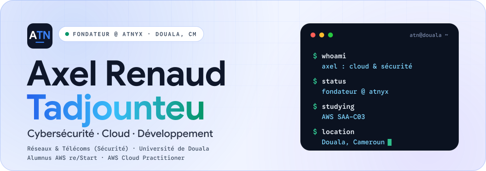</picture>

<h3><picture><source media="(prefers-color-scheme: dark)" srcset="assets/dark/h-about.fr.svg">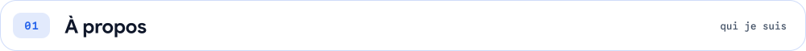</picture></h3>

Je suis **Axel Renaud Tadjounteu**, étudiant et développeur en cybersécurité et cloud, basé à Douala, au Cameroun. J'ai fondé **Atnyx**, une entreprise de services IT, et je suis en troisième année de licence Réseaux & Télécommunications (spécialité sécurité) à l'Université de Douala. Je suis alumnus AWS re/Start et titulaire de la certification **AWS Cloud Practitioner**.

J'aime suivre un système de bout en bout, du réseau au compte cloud jusqu'au formulaire de connexion, et trouver où il peut casser. Je construis en pensant à mon contexte : connexions instables, appareils modestes, petits budgets.

<h3><picture><source media="(prefers-color-scheme: dark)" srcset="assets/dark/h-approach.fr.svg">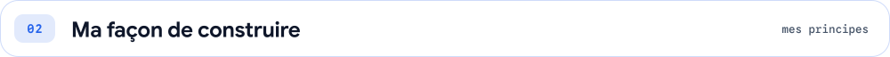</picture></h3>

<picture><source media="(prefers-color-scheme: dark)" srcset="assets/dark/principles.fr.svg">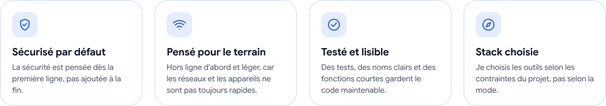</picture>

<h3><picture><source media="(prefers-color-scheme: dark)" srcset="assets/dark/h-now.fr.svg">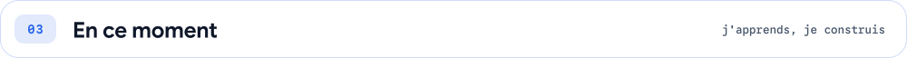</picture></h3>

- Je prépare l'examen **AWS Solutions Architect Associate (SAA-C03)**
- Je pratique des labs cloud et réseau en ligne de commande (gcloud, Cisco Packet Tracer)
- Je construis **NKUL** et la **Plateforme Atnyx**, et je conçois **Branchline**
- J'explore les agents IA avec l'Agent Development Kit de Google
- Je planifie un parcours de 12 mois vers **CompTIA Security+**

<h3><picture><source media="(prefers-color-scheme: dark)" srcset="assets/dark/h-atnyx.fr.svg">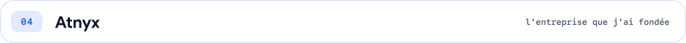</picture></h3>

Atnyx est l'entreprise de services IT que j'ai fondée à Douala. Elle couvre quatre domaines :

<picture><source media="(prefers-color-scheme: dark)" srcset="assets/dark/services.fr.svg">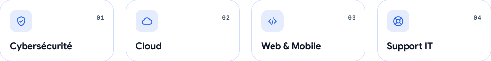</picture>

Autour d'elle, je construis la **Plateforme Atnyx** (un site multi-branches) et **NKUL**, un produit d'audit pour les PME africaines.

<h3><picture><source media="(prefers-color-scheme: dark)" srcset="assets/dark/h-projects.fr.svg">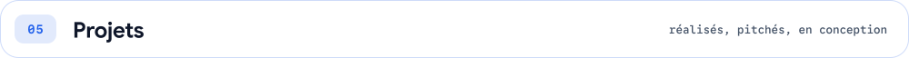</picture></h3>

<!-- Pour rendre une carte cliquable : ajoute son lien dans PROJECT_LINKS (scripts/content.py) puis relance build.py --readme -->

<picture><source media="(prefers-color-scheme: dark)" srcset="assets/dark/project-atnyx.fr.svg">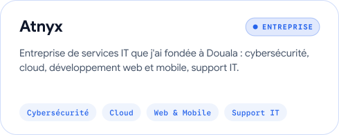</picture>
<picture><source media="(prefers-color-scheme: dark)" srcset="assets/dark/project-nkul.fr.svg">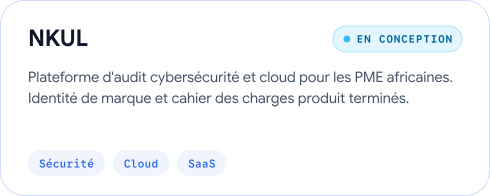</picture>
<picture><source media="(prefers-color-scheme: dark)" srcset="assets/dark/project-ecocamer.fr.svg">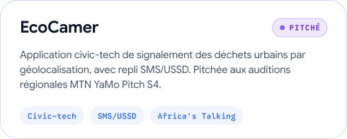</picture>
<picture><source media="(prefers-color-scheme: dark)" srcset="assets/dark/project-branchline.fr.svg">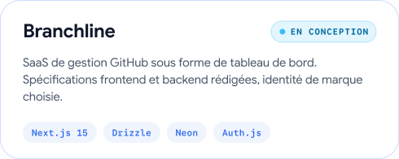</picture>
<picture><source media="(prefers-color-scheme: dark)" srcset="assets/dark/project-fansquad.fr.svg">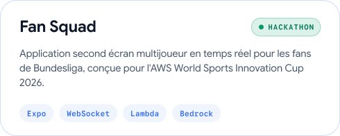</picture>
<a href="https://axeltadjounteu.vercel.app"><picture><source media="(prefers-color-scheme: dark)" srcset="assets/dark/project-portfolio.fr.svg">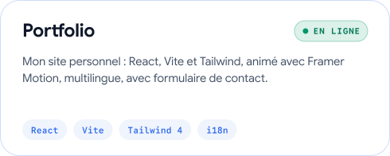</picture></a>

<h3><picture><source media="(prefers-color-scheme: dark)" srcset="assets/dark/h-toolbox.fr.svg">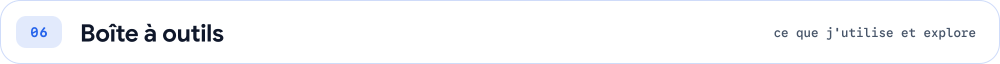</picture></h3>

<picture><source media="(prefers-color-scheme: dark)" srcset="assets/dark/toolbox-cloud.fr.svg">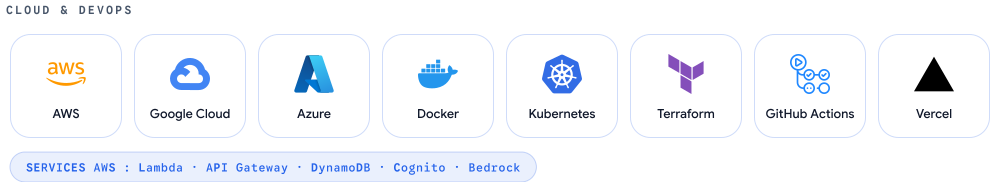</picture>

<picture><source media="(prefers-color-scheme: dark)" srcset="assets/dark/toolbox-security.fr.svg">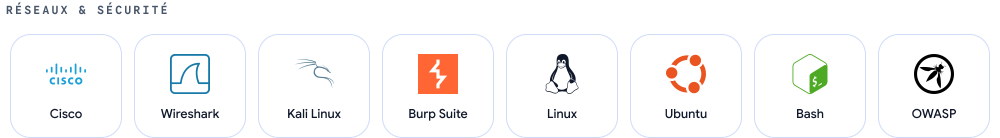</picture>

<picture><source media="(prefers-color-scheme: dark)" srcset="assets/dark/toolbox-dev.fr.svg">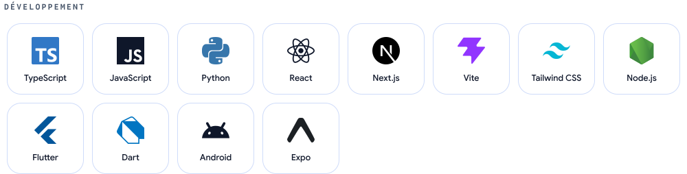</picture>

<picture><source media="(prefers-color-scheme: dark)" srcset="assets/dark/toolbox-data.fr.svg">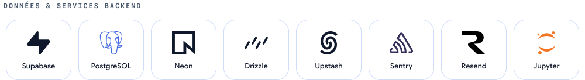</picture>

<picture><source media="(prefers-color-scheme: dark)" srcset="assets/dark/toolbox-ai.fr.svg">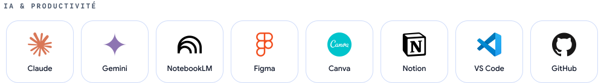</picture>

<h3><picture><source media="(prefers-color-scheme: dark)" srcset="assets/dark/h-labs.fr.svg">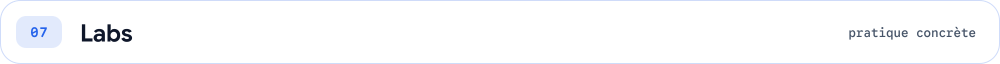</picture></h3>

- **Google Cloud Skills Boost** : labs à défi réalisés entièrement en CLI (agents ADK, GKE, Cloud Run, VPN HA, VPC Flow Logs vers BigQuery)
- **Réseau** : labs Cisco Packet Tracer sur les VLAN, ACL, DMZ et pare-feu, VPN IPsec
- **Sécurité** : parcours pratiques sur Cisco NetAcad, Fortinet NSE, PortSwigger Academy et TryHackMe
<!-- Quand les dépôts existent : ajoute [cloud-labs](https://github.com/axeltadjounteu17/cloud-labs) et [network-security-labs](https://github.com/axeltadjounteu17/network-security-labs) -->

<h3><picture><source media="(prefers-color-scheme: dark)" srcset="assets/dark/h-certs.fr.svg">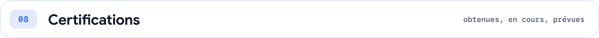</picture></h3>

<!-- Pour lier une carte à sa preuve (Credly...) : ajoute-la dans CERT_PROOF (scripts/content.py) -->

<picture><source media="(prefers-color-scheme: dark)" srcset="assets/dark/cert-restart.fr.svg">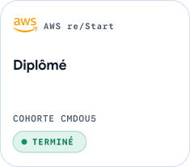</picture>
<picture><source media="(prefers-color-scheme: dark)" srcset="assets/dark/cert-clf.fr.svg">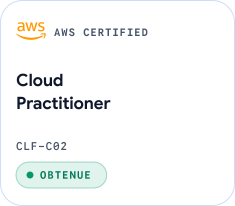</picture>
<picture><source media="(prefers-color-scheme: dark)" srcset="assets/dark/cert-saa.fr.svg">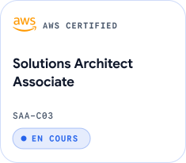</picture>
<picture><source media="(prefers-color-scheme: dark)" srcset="assets/dark/cert-secplus.fr.svg">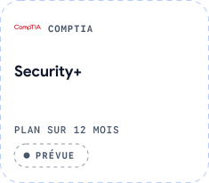</picture>

<picture><source media="(prefers-color-scheme: dark)" srcset="assets/dark/toolbox-learning.fr.svg">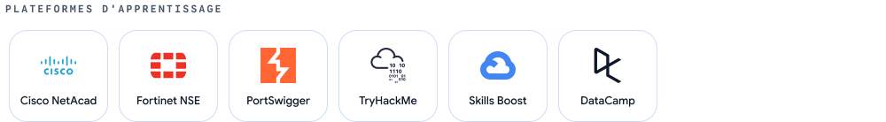</picture>

<h3><picture><source media="(prefers-color-scheme: dark)" srcset="assets/dark/h-achievements.fr.svg"></picture></h3>

<picture><source media="(prefers-color-scheme: dark)" srcset="assets/dark/achievements.fr.svg">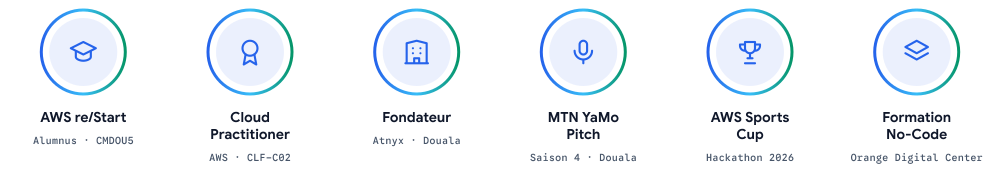</picture>

<h3><picture><source media="(prefers-color-scheme: dark)" srcset="assets/dark/h-activity.fr.svg">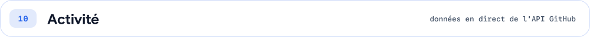</picture></h3>

<picture><source media="(prefers-color-scheme: dark)" srcset="assets/dark/activity.fr.svg">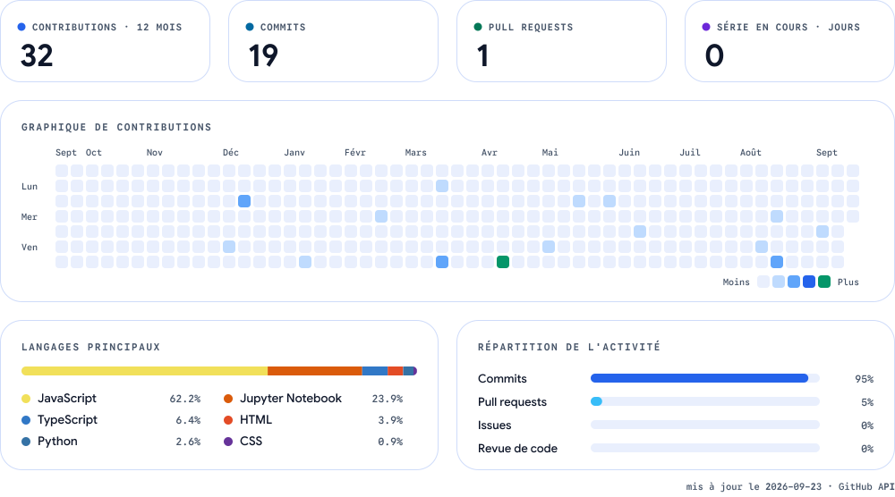</picture>

<h3><picture><source media="(prefers-color-scheme: dark)" srcset="assets/dark/h-content.fr.svg">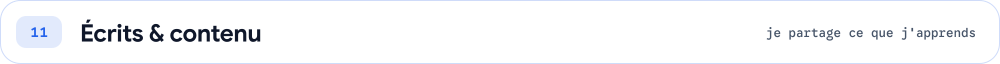</picture></h3>

Je publie des vidéos courtes sur **TikTok** et des posts **LinkedIn** sur la cybersécurité, le cloud et le développement, pour expliquer simplement ce que j'apprends.

<a href="https://www.tiktok.com/@axeltngr17"><picture><source media="(prefers-color-scheme: dark)" srcset="assets/dark/channel-tiktok.fr.svg">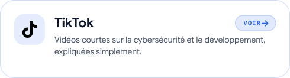</picture></a>
<a href="https://www.linkedin.com/in/axel-tadjounteu-060502296"><picture><source media="(prefers-color-scheme: dark)" srcset="assets/dark/channel-linkedin.fr.svg">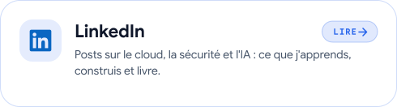</picture></a>

<h3><picture><source media="(prefers-color-scheme: dark)" srcset="assets/dark/h-contact.fr.svg">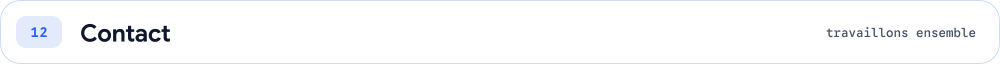</picture></h3>

Ouvert aux collaborations, et aux projets via **Atnyx**.

<a href="https://axeltadjounteu.vercel.app"><picture><source media="(prefers-color-scheme: dark)" srcset="assets/dark/btn-portfolio.fr.svg"></picture></a>
<a href="https://www.linkedin.com/in/axel-tadjounteu-060502296"><picture><source media="(prefers-color-scheme: dark)" srcset="assets/dark/btn-linkedin.fr.svg"></picture></a>
<a href="mailto:axeltadjounteu@gmail.com"><picture><source media="(prefers-color-scheme: dark)" srcset="assets/dark/btn-email.fr.svg"></picture></a>
<a href="https://www.tiktok.com/@axeltngr17"><picture><source media="(prefers-color-scheme: dark)" srcset="assets/dark/btn-tiktok.fr.svg"></picture></a>

