
<a href="README.fr.md">Français</a>

<picture><source media="(prefers-color-scheme: dark)" srcset="assets/dark/banner.en.svg">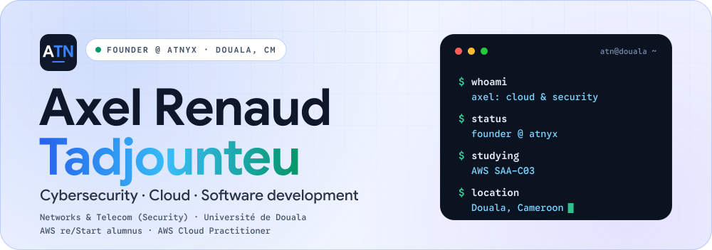</picture>

<h3><picture><source media="(prefers-color-scheme: dark)" srcset="assets/dark/h-about.en.svg">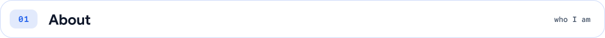</picture></h3>

I'm **Axel Renaud Tadjounteu**, a cybersecurity and cloud student and developer from Douala, Cameroon. I founded **Atnyx**, an IT services company, and I'm in my third year of a Networks & Telecommunications degree (security track) at the Université de Douala. I'm an AWS re/Start alumnus and hold the **AWS Cloud Practitioner** certification.

I like following a system end to end, from the network to the cloud account to the login form, and finding where it can break. I build with my context in mind: unreliable connections, low-end devices, small budgets.

<h3><picture><source media="(prefers-color-scheme: dark)" srcset="assets/dark/h-approach.en.svg">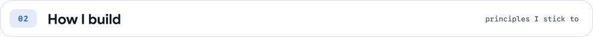</picture></h3>

<picture><source media="(prefers-color-scheme: dark)" srcset="assets/dark/principles.en.svg">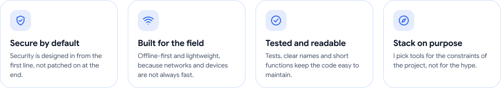</picture>

<h3><picture><source media="(prefers-color-scheme: dark)" srcset="assets/dark/h-now.en.svg">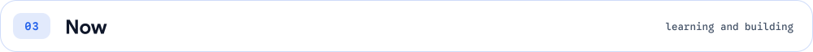</picture></h3>

- Preparing the **AWS Solutions Architect Associate (SAA-C03)** exam
- Doing cloud and network labs from the command line (gcloud, Cisco Packet Tracer)
- Building **NKUL** and the **Atnyx Platform**, and designing **Branchline**
- Exploring AI agents with Google's Agent Development Kit
- Planning a 12-month path toward **CompTIA Security+**

<h3><picture><source media="(prefers-color-scheme: dark)" srcset="assets/dark/h-atnyx.en.svg">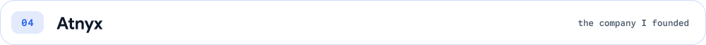</picture></h3>

Atnyx is the IT services company I founded in Douala. It covers four areas:

<picture><source media="(prefers-color-scheme: dark)" srcset="assets/dark/services.en.svg">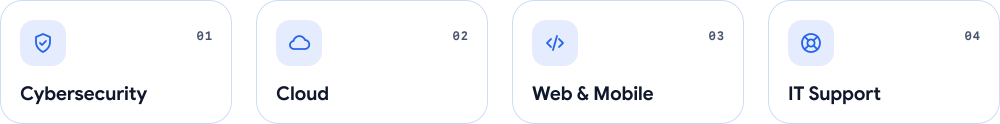</picture>

Around it, I'm building the **Atnyx Platform** (a multi-branch website) and **NKUL**, an audit product for African SMEs.

<h3><picture><source media="(prefers-color-scheme: dark)" srcset="assets/dark/h-projects.en.svg"></picture></h3>

<!-- Pour rendre une carte cliquable : ajoute son lien dans PROJECT_LINKS (scripts/content.py) puis relance build.py --readme -->

<picture><source media="(prefers-color-scheme: dark)" srcset="assets/dark/project-atnyx.en.svg">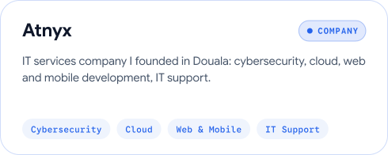</picture>
<picture><source media="(prefers-color-scheme: dark)" srcset="assets/dark/project-nkul.en.svg">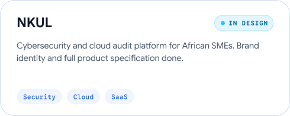</picture>
<picture><source media="(prefers-color-scheme: dark)" srcset="assets/dark/project-ecocamer.en.svg">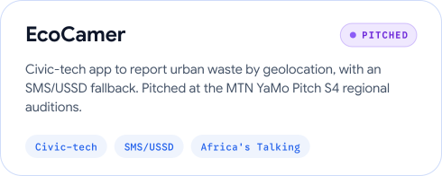</picture>
<picture><source media="(prefers-color-scheme: dark)" srcset="assets/dark/project-branchline.en.svg">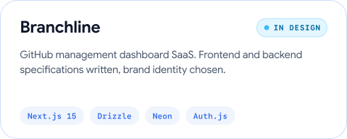</picture>
<picture><source media="(prefers-color-scheme: dark)" srcset="assets/dark/project-fansquad.en.svg">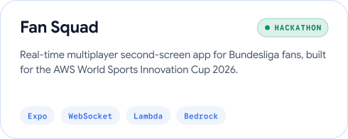</picture>
<a href="https://axeltadjounteu.vercel.app"><picture><source media="(prefers-color-scheme: dark)" srcset="assets/dark/project-portfolio.en.svg">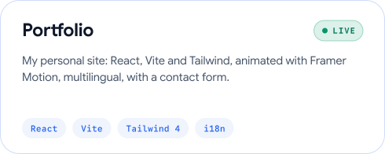</picture></a>

<h3><picture><source media="(prefers-color-scheme: dark)" srcset="assets/dark/h-toolbox.en.svg">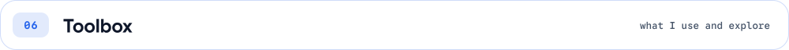</picture></h3>

<picture><source media="(prefers-color-scheme: dark)" srcset="assets/dark/toolbox-cloud.en.svg">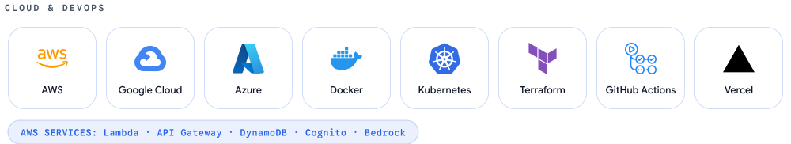</picture>

<picture><source media="(prefers-color-scheme: dark)" srcset="assets/dark/toolbox-security.en.svg">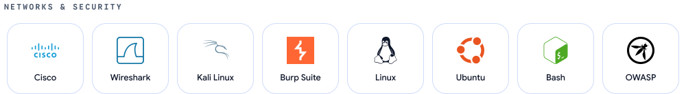</picture>

<picture><source media="(prefers-color-scheme: dark)" srcset="assets/dark/toolbox-dev.en.svg">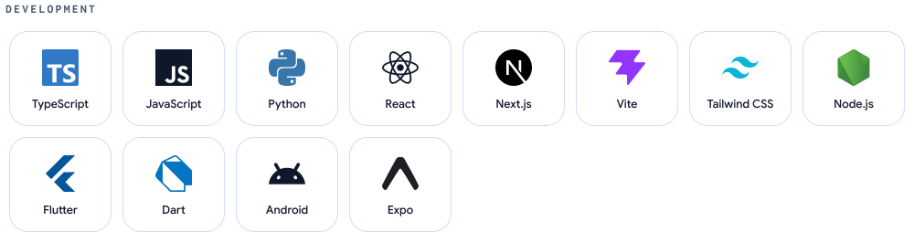</picture>

<picture><source media="(prefers-color-scheme: dark)" srcset="assets/dark/toolbox-data.en.svg">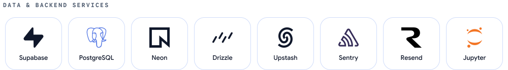</picture>

<picture><source media="(prefers-color-scheme: dark)" srcset="assets/dark/toolbox-ai.en.svg">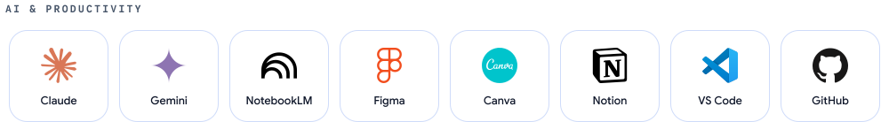</picture>

<h3><picture><source media="(prefers-color-scheme: dark)" srcset="assets/dark/h-labs.en.svg">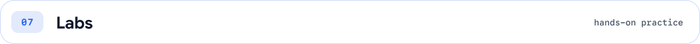</picture></h3>

- **Google Cloud Skills Boost**: challenge labs done entirely from the CLI (ADK agents, GKE, Cloud Run, HA VPN, VPC Flow Logs to BigQuery)
- **Networking**: Cisco Packet Tracer labs on VLANs, ACLs, DMZ and firewall, IPsec VPN
- **Security**: hands-on paths on Cisco NetAcad, Fortinet NSE, PortSwigger Academy and TryHackMe
<!-- Quand les dépôts existent : ajoute [cloud-labs](https://github.com/axeltadjounteu17/cloud-labs) et [network-security-labs](https://github.com/axeltadjounteu17/network-security-labs) -->

<h3><picture><source media="(prefers-color-scheme: dark)" srcset="assets/dark/h-certs.en.svg">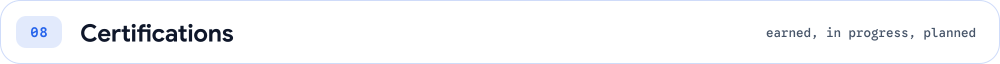</picture></h3>

<!-- Pour lier une carte à sa preuve (Credly...) : ajoute-la dans CERT_PROOF (scripts/content.py) -->

<picture><source media="(prefers-color-scheme: dark)" srcset="assets/dark/cert-restart.en.svg">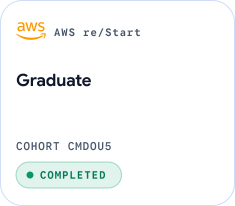</picture>
<picture><source media="(prefers-color-scheme: dark)" srcset="assets/dark/cert-clf.en.svg">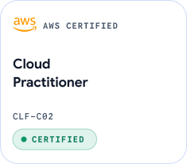</picture>
<picture><source media="(prefers-color-scheme: dark)" srcset="assets/dark/cert-saa.en.svg">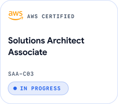</picture>
<picture><source media="(prefers-color-scheme: dark)" srcset="assets/dark/cert-secplus.en.svg">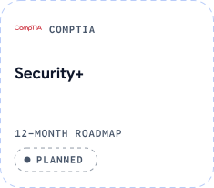</picture>

<picture><source media="(prefers-color-scheme: dark)" srcset="assets/dark/toolbox-learning.en.svg">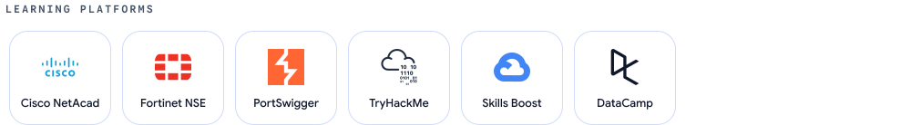</picture>

<h3><picture><source media="(prefers-color-scheme: dark)" srcset="assets/dark/h-achievements.en.svg">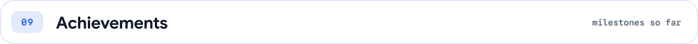</picture></h3>

<picture><source media="(prefers-color-scheme: dark)" srcset="assets/dark/achievements.en.svg">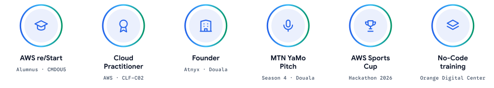</picture>

<h3><picture><source media="(prefers-color-scheme: dark)" srcset="assets/dark/h-activity.en.svg">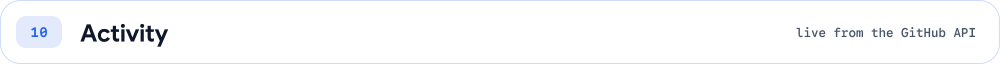</picture></h3>

<picture><source media="(prefers-color-scheme: dark)" srcset="assets/dark/activity.en.svg">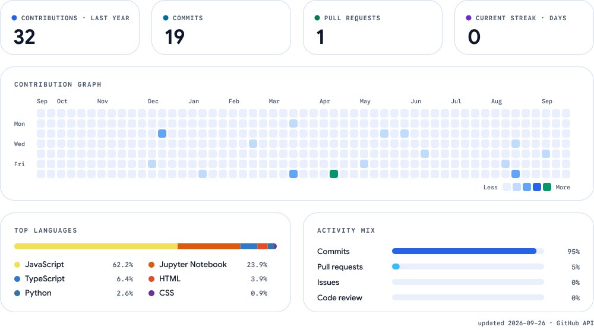</picture>

<h3><picture><source media="(prefers-color-scheme: dark)" srcset="assets/dark/h-content.en.svg">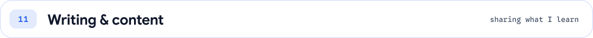</picture></h3>

I make short videos on **TikTok** and write **LinkedIn** posts about cybersecurity, cloud and development, to explain what I learn in plain language.

<a href="https://www.tiktok.com/@axeltngr17"><picture><source media="(prefers-color-scheme: dark)" srcset="assets/dark/channel-tiktok.en.svg">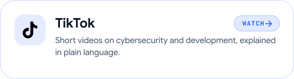</picture></a>
<a href="https://www.linkedin.com/in/axel-tadjounteu-060502296"><picture><source media="(prefers-color-scheme: dark)" srcset="assets/dark/channel-linkedin.en.svg">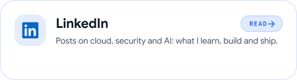</picture></a>

<h3><picture><source media="(prefers-color-scheme: dark)" srcset="assets/dark/h-contact.en.svg">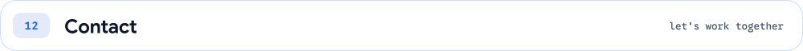</picture></h3>

Open to collaborations, and to projects through **Atnyx**.

<a href="https://axeltadjounteu.vercel.app"><picture><source media="(prefers-color-scheme: dark)" srcset="assets/dark/btn-portfolio.en.svg"></picture></a>
<a href="https://www.linkedin.com/in/axel-tadjounteu-060502296"><picture><source media="(prefers-color-scheme: dark)" srcset="assets/dark/btn-linkedin.en.svg"></picture></a>
<a href="mailto:axeltadjounteu@gmail.com"><picture><source media="(prefers-color-scheme: dark)" srcset="assets/dark/btn-email.en.svg"></picture></a>
<a href="https://www.tiktok.com/@axeltngr17"><picture><source media="(prefers-color-scheme: dark)" srcset="assets/dark/btn-tiktok.en.svg"></picture></a>

